CocoaPods 是开发 OS X 和 iOS 应用程序的一个很好用的依赖管理工具，我们常用来管理和更新第三方库。其实它还有一个很有用的特性——管理团队内部的私有库。当公司项目越来越大、越来越多的时候，我们会把一些基础的公共类、工具类、网络请求等抽离出来。而Cocoapods提供的Private Spec Repo可以帮助我们很好的管理我们的公共代码。

<!-- more -->

可以看一下CocoaPods的[官方文档](https://guides.cocoapods.org/making/private-cocoapods.html)介绍
> CocoaPods is a great tool not only for adding open source code to your project, but also for sharing components across projects. You can use a private Spec Repo to do this.

## Cocoapods 的工作原理
首先简单了解一下Cocoapods的工作原理。不管是我们平时使用的开源库还是我们自己的私有库，都有一个对应的podspec文件，这个文件描述了这个库的很多信息。我们熟悉的第三方开源库的podspec文件通常被放在CocoaPods的master库中，地址是[https://github.com/CocoaPods/Specs](https://github.com/CocoaPods/Specs)。当执行pod install时，CocoaPods 会到 master 库中将我们要安装的开源库的podspec文件找出来，然后再根据podspec中存储的代码地址，版本信息等去下载、更新真正的库。通常podspec长这样。
```
{
  "name": "xxx",
  "version": "1.0.0",
  "summary": "xxx",
  "description": "xxx",
  "homepage": "https://github.com/xxx/xxx",
  "license": "MIT",
  "authors": {
    "xxx": "xxx@gmail.com"
  },
  "platforms": {
    "ios": "8.0"
  },
  "source": {
    "git": "https://github.com/xxx/xxx.git",
    "tag": "1.0.0"
  },
  "source_files": "xxx/**/*.{h,m}"
}
```
## 创建私有Pod库
前面讲到开源库的podspec文件是放在CocoaPods上的，这是对所有人公开的。那我们自己的私有库肯定不能放在上面了，所以我们需要在我们私有的服务器上单独建一个私有Pod库。这里为了演示还是放在Github上，实际应用中切记建在自己的Git、SVN等服务器上。
首先在Github上新建一个自己的仓库：

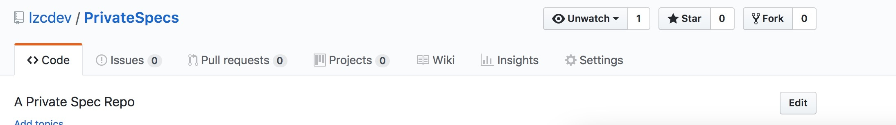

创建好之后，将仓库添加到 CocoaPods 本地的仓库列表中
```
pod repo add privateSpecs https://github.com/lzcdev/PrivateSpecs
```
检查一下是否安装好
```
cd ~/.cocoapods/repos/PrivateSpecs
```
```
pod repo lint .
```
出现下图所示说明验证正常。
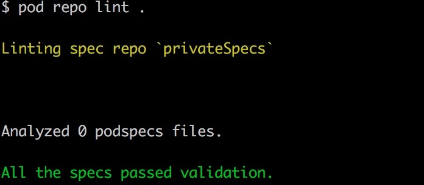
我们执行一下
```
open ..
```
可以看到privateSpecs已经在本地了，不过它现在里面什么也没有，接下来我们需要制作podspec文件并放到这个仓库中

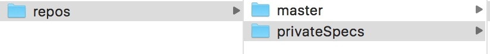


## 创建Pod项目工程文件
比如我们要创建一个私有库叫LogTool，这里仅作演示，实际项目中的库肯定更加复杂。在桌面执行以下命令
```
pod lib create LogTool
```
执行完之后会问你几个问题，按实际情况填就好。填完之后会自动帮你创建好工程并打开。


生成的项目结构如下：


pod lib create 会为我们创建一个 Workspace，里面包含两个 Project， LogTool 是我们 Pod 库的 Demo 项目, Pods 是我们实际开发的库的代码。
我们可以修改 Pods/Development Pods/LogTool/LogTool/Classes/ReplaceMe.swift 这个文件，将它重命名为 LogTool.swift, 然后写入如下代码：
```
public class LogTool {
    static public func LogTest () -> Void{
        print("It's a logTool")
    }
}
```
接下来在Example for LogTool／ViewController.swift中使用我们的库
```
import UIKit
import LogTool

class ViewController: UIViewController {

    override func viewDidLoad() {
        super.viewDidLoad()
        LogTool.LogTest()
    }
}
```
运行项目，可以看到调用成功了。
## 修改podspec文件
我们在Podspec Metadata下可以看到有一个LogTool.podspec文件。编辑这个文件
```
#
# Be sure to run `pod lib lint LogTool.podspec' to ensure this is a
# valid spec before submitting.
#
# Any lines starting with a # are optional, but their use is encouraged
# To learn more about a Podspec see http://guides.cocoapods.org/syntax/podspec.html
#

Pod::Spec.new do |s|
  s.name             = 'LogTool'
  s.version          = '0.1.0'
  s.summary          = 'Use it to log messages'

  s.description      = <<-DESC
It's a demo for LogTool
                       DESC

  s.homepage         = 'https://github.com/lzcdev/LogTool'
  s.license          = { :type => 'MIT', :file => 'LICENSE' }
  s.author           = { 'lzcdev' => 'lzc2134@gmail.com' }
  s.source           = { :git => 'https://github.com/lzcdev/LogTool.git', :tag => s.version.to_s }
  s.ios.deployment_target = '8.0'
  s.source_files = 'LogTool/Classes/**/*'
  
end
```
接下来在项目根目录下执行`pod lib lint LogTool.podspec`来检查一下有没有什么错误。

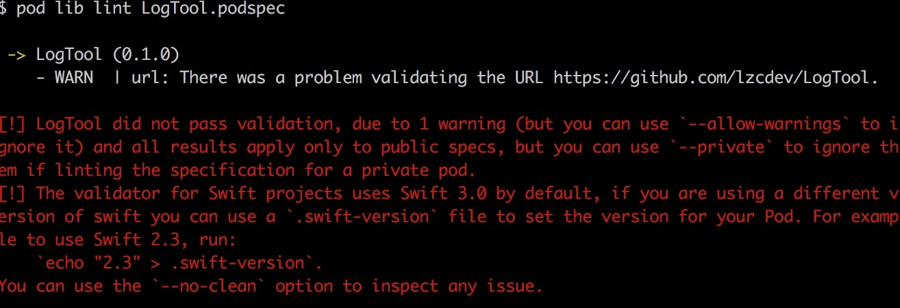
可以看到报一个错误，这是因为Swift需要指定一下版本。所以这里要记得以后要提前指定一下版本。按照提示执行
```
echo "4.0" > .swift-version
```
然后继续执行`pod lib lint LogTool.podspec`,这时会报一个警告：

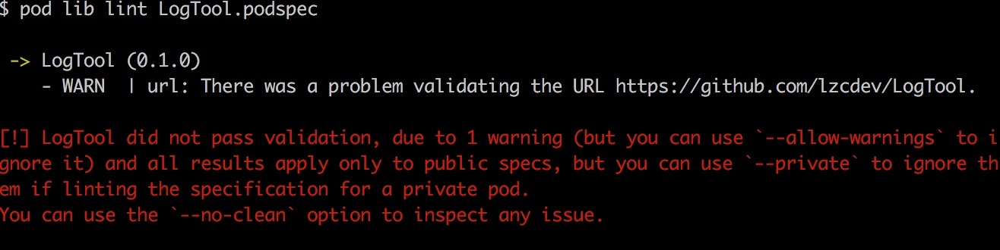
警告不影响库的正常使用，按照提示加上`--allow-warnings`允许警告就好了。继续执行` pod lib lint LogTool.podspec --allow-warnings`。这次终于检查通过了

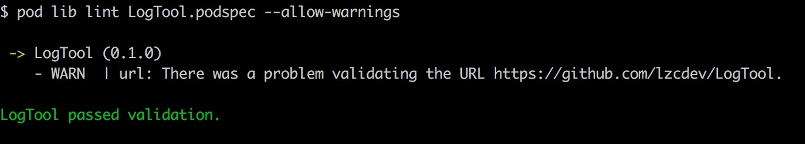
## 准备发布
在GitHub上创建一个存放代码的仓库，当然在实际项目中应该在本地服务器创建。创建一个名为LogTool的仓库，并把刚才帮我们生成的项目push进去。

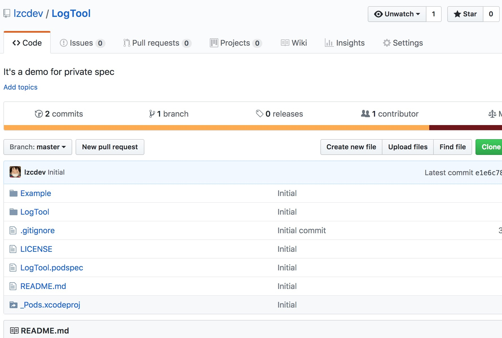

然后我们创建一个release版本

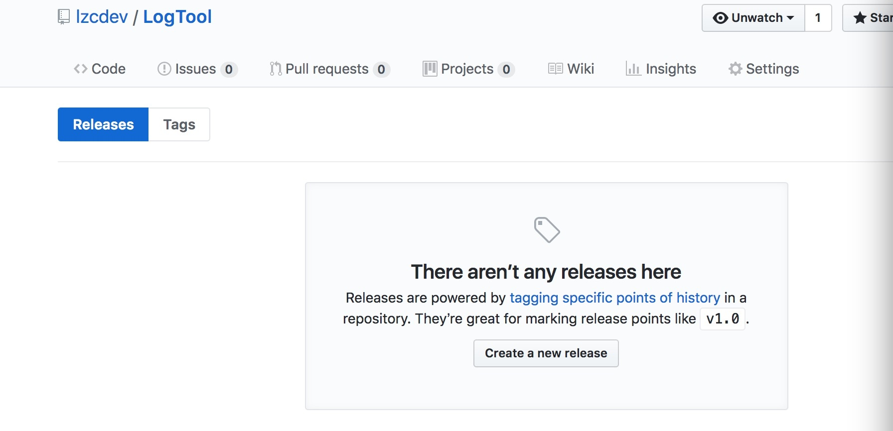
填入对应信息，然后点击绿色的Publish release按钮
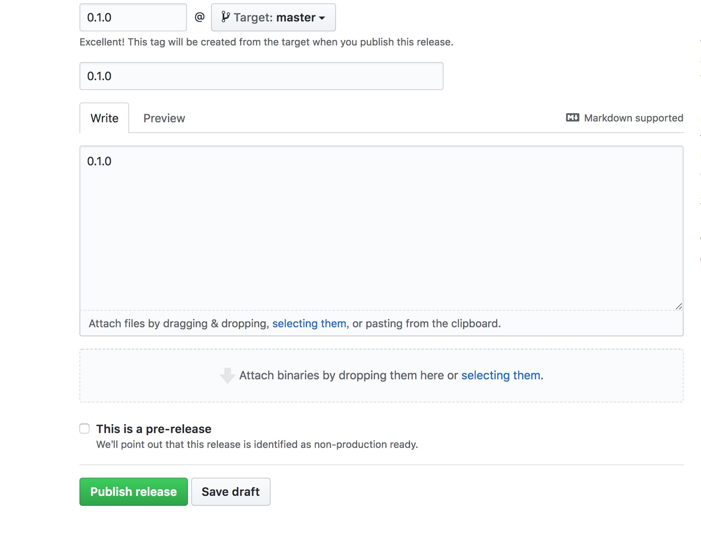

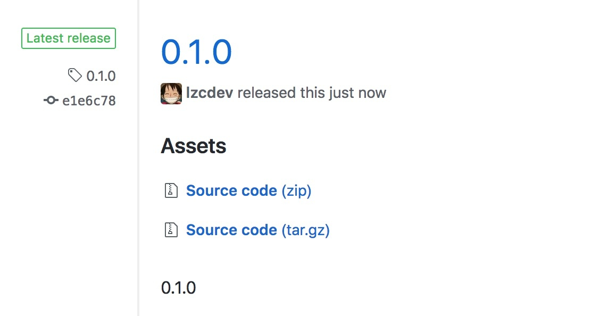
## 发布
还记得前面创建的PrivateSpecs仓库吗，我们现在需要把podspec文件push上去。在项目根目录运行：
```
pod repo push privateSpecs LogTool.podspec
```
看到下图说明成功了

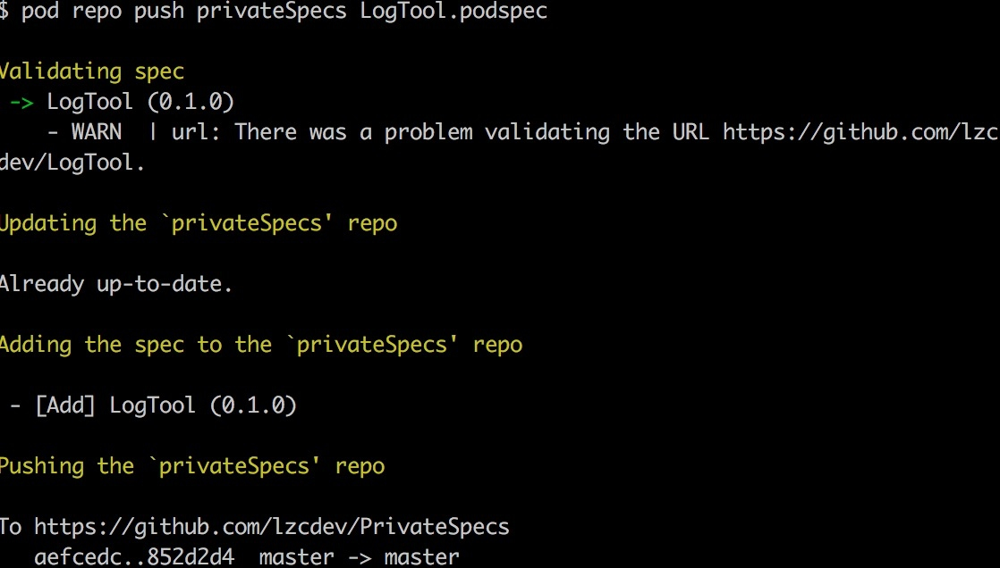
可以去看一下PrivateSpecs看一下，确实是push上来了。

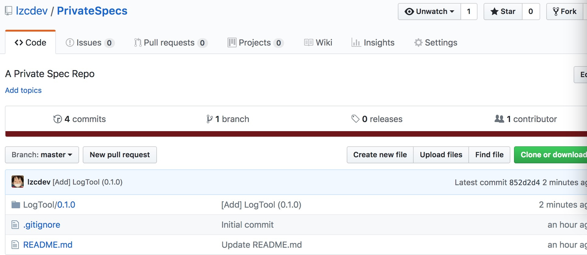
## 在项目中使用
新建一个项目TestPrivatePod,在根目录执行pod init生成一个Podfile文件。这时可以执行`pod search LogTool`搜索一下我们的私有库：

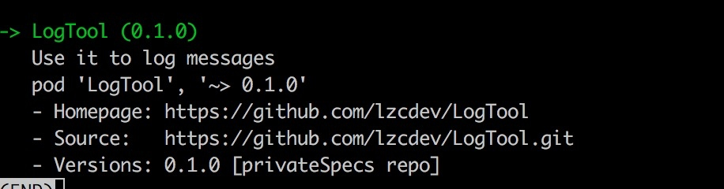
编辑Podfile文件：
```
source "https://github.com/lzcdev/PrivateSpecs"
target 'TestPrivatePod' do
use_frameworks!
pod "LogTool"
end
```
这里需要特别注意，这和平时用开源库不同，多了一个source，用来指定从哪个spec仓库抓取内容。这里还有一个问题是假如我们需要同时使用开源库和私有库怎么办呢？答案就是要同时指定私有库和开源库的source。[官方文档](http://guides.cocoapods.org/syntax/podfile.html#source)也有相应的说明。类似这样
```
source "https://github.com/lzcdev/PrivateSpecs"
source "https://github.com/CocoaPods/Specs"
```
接下来执行pod install安装。好了，测试一下吧！
## 总结
制作一个私有库大致可以分以下几步
1. 在本地服务器建一个仓库存放我们私有库的podspec文件。（这一步创建一次就够了，更新库或者增加库都不需要再重新创建了，只需要把对应的podspec文件push进来就可以了）
2. 创建项目工程文件
3. 修改podspec文件
4. 创建release版本
5. 把podspec文件push到存放spec文件的私有仓库


