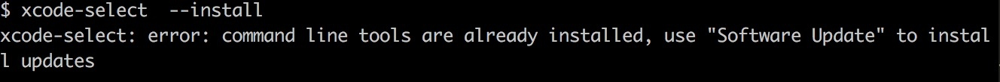
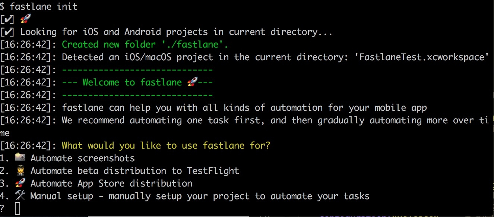
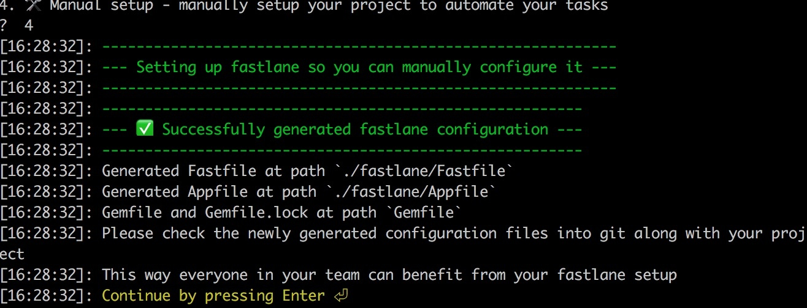

之前尝试使用`Jenkins`来持续集成，但是发现配置起来比较繁琐，后来发现 [Fastlane](https://github.com/fastlane/fastlane) 完全可以满足我的需求。Fastlane 是一款为 iOS 和 Android 开发者提供的自动化构建工具，它可以帮助开发者将 App 打包、签名、测试、发布、信息整理、提交 App Store 等工作完整的连接起来，实现完全自动化的工作流，如果使用得当，可以显著的提高开发者的开发效率。

## 安装
#### 安装 [ruby](https://github.com/ruby/ruby) 
因为 Fastlane 是基于 ruby 的。执行`ruby -v`看一下 ruby 是否安装，如果没安装可根据文档安装。
```
ruby -v
```
#### 安装Xcode命令行工具
```
xcode-select  --install
```
如果出现下图所示说明已安装，如果没安装，按提示安装即可。


#### 安装fastlane
```
sudo gem install fastlane
```
## 打包
#### 切换到工程目录初始化
```
fastlane init
```
执行之后会出现下图所以几个选项，根据提示这里一般是选第4个手动设置。

之后出现下图所示说明初始化成功


之后根据提示一直按Enter就可以了。
#### 编辑配置文件
初始化成功之后会看到工程目录下多了一个 fastlane 的文件夹。里面有 Appfile 和 Fastfile 两个文件。首先编辑 Appfile 。填上你的 Bundle Identifier 和 Apple 账号的邮箱.
```
app_identifier("xxx") # The bundle identifier of your app
apple_id("xxx") # Your Apple email address


# For more information about the Appfile, see:
#     https://docs.fastlane.tools/advanced/#appfile
```
之后编辑 Fastfile
```
default_platform(:ios)

platform :ios do
  desc "This is a test"
  lane :make_ipa do
    # add actions here: https://docs.fastlane.tools/actions
    dir="./fastlane/build/Package"
    puts("*************| 打包项目到目录 |*************")
  	# 开始打包
	gym(
		#输出的ipa名称
		scheme: "",#如果没有可不填，不过一般项目里都有
		output_name:"fastlane_test#{get_build_number()}",
		silent: false,  # 隐藏没有必要的building信息
		clean:false,		# 是否清空以前的编译信息 true：是
		configuration:"Release",	# 指定打包方式，Release 或者 Debug
		export_method:"development",	# 指定打包所使用的输出方式，目前支持app-store, package, ad-hoc, enterprise, development
		buildlog_path: "#{dir}/fastlanelog",  # fastlane构建ipa的日志输出目录
		output_directory:"#{dir}",	# 指定输出文件夹
		)
	puts("\n*************| 打包完成 |*************\n")
  end
end
```
编辑好之后执行
```
fastlane make_ipa
```
顺利的话是可以看到下图这样的信息，之后可去相应的文件夹查看打好的包


## 发布上传
只打好包还是不够的，我们还需要上传到第三方平台或者 App Store 。
#### 上传到[蒲公英](https://www.pgyer.com/)
有了ipa包之后这里其实就比较简单了，[官方文档](https://www.pgyer.com/doc/view/fastlane)说的很清楚。安装蒲公英的 Fastlane 插件后，这里只需在刚才的脚本下面加上一句话就可以了
```
pgyer(api_key: "7f15xxxxxxxxxxxxxxxxxx141", user_key: "4a5bcxxxxxxxxxxxxxxx3a9e")
```
之后在执行之前的打包命令就可以实现自动打包并上传到蒲公英了。
#### 上传到 App Store
这一步也很简单，把刚才蒲公英的脚本替换成 `upload_to_app_store`就可以了
## 完整 Demo
```ruby
default_platform(:ios)

platform :ios do
  desc "Description of what the lane does"
  lane :custom_lane do
    # add actions here: https://docs.fastlane.tools/actions
    dir="./fastlane/build/Package"
    puts("*************| 打包项目到目录 |*************")
  	# 开始打包
	gym(
		#输出的ipa名称
		scheme: "",
		output_name:"fastlane_test_#{get_build_number()}",
		silent: false,  # 隐藏没有必要的building信息
		clean:false,		# 是否清空以前的编译信息 true：是
		configuration:"Release",	# 指定打包方式，Release 或者 Debug
		export_method:"development",	# 指定打包所使用的输出方式，目前支持app-store, package, ad-hoc, enterprise, development
		buildlog_path: "#{dir}/fastlanelog",  # fastlane构建ipa的日志输出目录
		output_directory:"#{dir}",	# 指定输出文件夹
		)
	puts("\n*************| 打包完成 |*************\n")
	pgyer(api_key: "xxx", user_key: "xxx") # 上传到蒲公英
	# upload_to_app_store # 上传到App store
 	notification(title: "打包成功!", message: "打包成功,已成功上传")
	
  end
end
```
