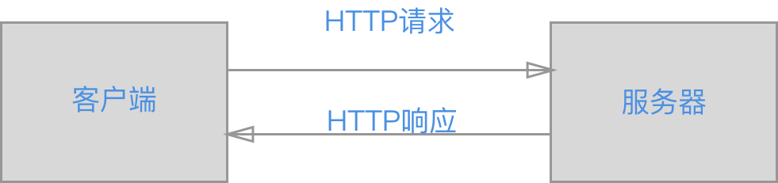

HTTP协议英文名字为（HyperText Transfer Protoco），是一种用于分布式、协作式和超媒体信息系统的应用层协议。在我们日常上网中，无时无刻不在用这个协议。HTTP是万维网的数据通信的基础。

<!--more-->
## HTTP协议是什么？
HTTP 协议是互联网应用中，客户端（浏览器）与服务器之间进行数据通信的一种协议。它允许将超文本标记语言(HTML)文档从Web服务器传送到客户端的浏览器。协议就是规则，大家都按这个规则来，那就能正常工作。比如说在浏览器输入`https://www.baidu.com`之后可以看到页面显示出内容，这里面就用到了HTTP协议。
## HTTP工作原理



他的工作原理非常简单，就是客户端向服务端发起一个请求，服务器返回信息给客户端。当然具体的实现细节也是相当复杂的。
HTTP有以下几个特点：
- 简单：客户向服务器请求服务时，只需传送请求方法和路径。请求方法常用的有GET、HEAD、POST。每种方法规定了客户与服务器联系的不同类型。由于HTTP协议简单，使得HTTP服务器的程序规模小，因而通信速度很快。
- 灵活：HTTP允许传输任意类型的数据对象。正在传输的类型由Content-Type加以标记。
- HTTP是无连接的：无连接的含义是限制每次连接只处理一个请求。服务器处理完客户的请求，并收到客户的应答后，即断开连接。采用这种方式可以节省传输时间。
- HTTP是无状态的：无状态是指协议对于事务处理没有记忆能力。也就是不做持久化，缺少状态意味着如果后续处理需要前面的信息，则它必须重传，这样可能导致每次连接传送的数据量增大。另一方面，在服务器不需要先前信息时它的应答就较快。
一次完整的HTTP请求包括以下几步：
1. 浏览器输入网址https://www.xxx.com
2. 浏览器根据域名解析IP地址，类似于192.168.x.xx
3. 浏览器与web服务器建立一个TCP连接
4. 浏览器给web服务器发送一个http请求
5. 服务器的永久重定向响应
6. 浏览器跟踪重定向地址
7. 服务器“处理”请求
8. 服务器发回一个HTML响应
9. 释放TCP连接
10. 客户端浏览器解析HTML内容
11. 浏览器获取嵌入在HTML中的对象，呈现页面

## HTTP请求
HTTP请求由4部分组成，分别是请求行（request line）、请求头部（header）、空行和请求数据四个部分组成。其中请求头和请求体不是必须的。而请求行是必须有的，它由3部分组成，分别是请求方法（method)、请求URL（URI）、HTTP协议版本，以空格隔开，类似于这种形式`GET /index.html HTTP/1.1`。在HTTP1.1中请求方法总共有8种，分别是GET,、POST、 HEAD、OPTIONS、 PUT、 DELETE、 TRACE 、CONNECT 。其中GET和POST大家用的比较多。请求头(header)可以携带比较多的信息，比如说常见的Cookie和User-Agent等。请求体是客户端发给服务器的信息，比如登录时的账号密码，上传文件等信息
```
# 请求行
GET /index.html HTTP/1.1
# 请求头
User-Agent: curl/7.16.3 libcurl/7.16.3 OpenSSL/0.9.7l zlib/1.2.3
Cookie: xxx
Host: www.xxx.com
Accept-Language: en
# 请求体
a=b&c=d
```
## HTTP响应
HTTP响应也由四个部分组成，分别是：状态行、响应头、空行和响应体。其中状态行由3部分组成，分别是HTTP 协议版本号、状态码、以及对状态码的描述，类似于 `HTTP/1.1 200 OK`。
下面是常见的HTTP状态码：
-  200 - 请求成功
- 301 - 资源（网页等）被永久转移到其它URL
- 404 - 请求的资源（网页等）不存在
- 500 - 内部服务器错误

HTTP状态码分类，更加具体的状态码含义可以查阅相关资料
```table
分类       |      分类描述
1**         |    信息，服务器收到请求，需要请求者继续执行操作   
2**         |    成功，操作被成功接收并处理 
3**         |    重定向，需要进一步的操作以完成请求  
4**         |    客户端错误，请求包含语法错误或无法完成请求   
5**         |    服务器错误，服务器在处理请求的过程中发生了错误   
```
响应体是服务器返回的真正内容，也就是我们平时所说的调一个接口返回的结果。它返回的或许是一个网页，或许是一个json、xml结构的数据，之后的事情就是交给客户端来处理了。
```
# 状态行

# 响应头
Date: Mon, 27 Jul 2009 12:28:53 GMT
Server: Apache
Last-Modified: Wed, 22 Jul 2009 19:15:56 GMT
ETag: "34aa387-d-1568eb00"
Accept-Ranges: bytes
Content-Length: 51
Vary: Accept-Encoding
Content-Type: text/plain
# 响应体
<html>
...
</html>
```
HTTP还有一个重要的概念是Content-Type，内容类型，一般是指网页中存在的Content-Type，用于定义网络文件的类型和网页的编码，决定浏览器将以什么形式、什么编码读取这个文件。
## HTTPS
HTTP固然强大，但是也有缺点：
- 通信使用明文（不加密），内容可能会被窃听
- 不验证通信方的身份，有可能遭遇伪装
- 无法证明报文完整性，可能已经被篡改

HTTP协议中没有加密机制，但可以和SSL（安全套接字）或TLS（安全传输层协议）组合使用，以便加密HTTP的通信内容。与SSL组合使用的HTTP称为HTTPS。SSL不但可以提供加密功能，还有一套证书机制验证通信方身份以及对整个通信提供完整保护防止结果被修改。所以说：**HTTP+加密+认证+完整性保护=HTTPS**。


