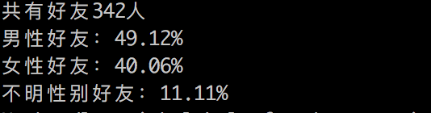
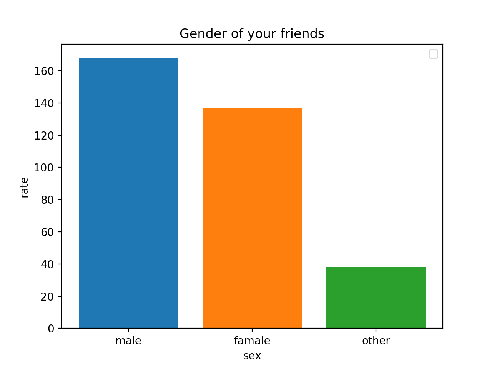
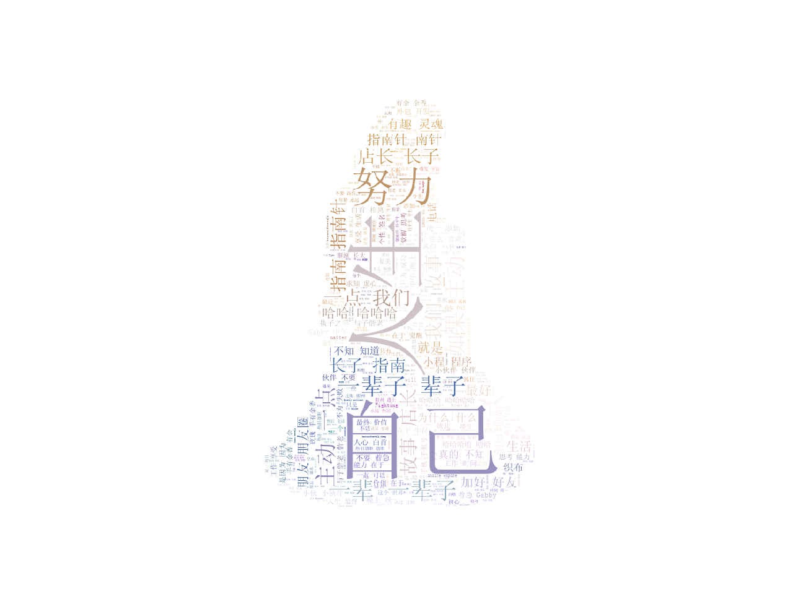

微信几乎是每天都会打开的一个App，今天就来简单分析一下微信好友的一些基本信息。最终目标是爬取所有微信好友并且分析男女比例、个性签名等数据。看似简单的功能用到的库其实不少。主要用到了`itchat`、`matplotlib`、`wordcloud`、`jieba`、`PIL`等库。不得不说Python的库是真的多，不过也确实好用。真的是感谢前辈们的付出。

<!-- more -->

## 爬取微信好友
爬取微信好友是利用的[itchat](https://github.com/littlecodersh/ItChat)这个库。itchat是一个开源的微信个人号接口，他的原理是利用了微信网页版的接口。所以使用这个库的时候，你登录的网页版、pc版微信会被顶掉。itchat提供了很多接口，这里用到的是`auto_login()`和`get_friends()`这两个方法。itchat还有一些其他有趣的接口可以研究一下。使用之前要先安装一下itchat。
```python
import itchat

itchat.auto_login(True)
friendList = itchat.get_friends(update=True)[0:]
print(friendList)
```
执行上面这段代码会生成一个二维码，微信扫码登录后会打印出一大串微信好友的信息。下面就是分析这些数据了。
## 分析好友性别
观察返回的数据，可以看到表示性别的字段是`Sex`，男性为1，女性为2，没写性别的是0。这里要吐槽一下目前表示性别的单词貌似都是`Gender`。不知道这里为什么还是`Sex`。
编写代码获取性别这个字段并保存在sexDic这个字典里。之后打印相应的数据，之后调用plt这个库画出比例图。
```python
import itchat
import matplotlib.pyplot as plt

sexDic = dict()
male = 'male'
famale = 'famale'
other = 'other'
itchat.auto_login(True)
friendList = itchat.get_friends(update=True)[0:]

for friend in friendList:
		sex = friend['Sex']
		if sex == 1:
			sexDic[male] = sexDic.get(male, 0) + 1
		elif sex == 2:
			sexDic[famale] = sexDic.get(famale, 0) + 1
		else:
			sexDic[other] = sexDic.get(other, 0) + 1
total = len(friendList[1:])
print('共有好友%d人' % total + '\n' + '男性好友：%.2f%%' % (float(sexDic[male]) / total * 100) + '\n' + '女性好友：%.2f%%' % (float(sexDic[famale]) / total * 100) + '\n' + '不明性别好友：%.2f%%' % (float(sexDic[other]) / total * 100))	

def draw(datas):
	for key in datas.keys():
		plt.bar(key, datas[key])

	plt.legend()
	plt.xlabel('sex')
	plt.ylabel('rate')
	plt.title("Gender of your friends")
	plt.show()

draw(sexDic)
```
执行上面的代码后可以看到已经打印成功并且得到柱状图。截至目前我的微信好友是这样的。


相应的柱状图：



## 制作好友微信签名词云图
进一步分析好友信息，用个性签名来制作词云。由于签名中有些表情会变成span、class、emoji这些无用信息，所以需要用正则过滤下。还有空格、特殊字符等都属于干扰信息，都需要过滤掉。之后利用[jieba](https://github.com/fxsjy/jieba)这个中文分词库把签名中的句子切割成词组并保存为txt文件。之后再利用[WordCloud](https://github.com/amueller/word_cloud)这个库制作词云。制作词云的时候需要找一张图片作为背景。其中要注意的是`font_path`这里必须设置一个字体，因为默认的字体是不支持中文的，所以去下载一个支持中文的字体，我这里用的是`SimSun.ttf`。完整代码如下：
```
import itchat
import time
import numpy as np
import matplotlib.pyplot as plt
import re
import io
import jieba
from wordcloud import WordCloud, ImageColorGenerator
from PIL import Image

def parse_signature():
	print('please wait a minute...')
	signatureList = []
	itchat.auto_login()
	friendList = itchat.get_friends(update=True)[0:]
	for friend in friendList:
		signature = friend['Signature'].strip().replace("span", "").replace("class", "").replace("emoji","")
		# print(friend['Signature'] + '\n' + friend['NickName'])
		rep = re.compile("1f\d+\w*|[<>/=]")
		signature = rep.sub("", signature)
		signatureList.append(signature)
	text = "".join(signatureList)
	with io.open('signature.txt', 'a', encoding='utf-8') as f:
		wordlist = jieba.cut(text, cut_all=True)
		word_space_split = " ".join(wordlist)
		f.write(word_space_split)
		f.close()
		draw_signature()	
		
def draw_signature():
	text = open(u'signature.txt', encoding='utf-8').read()
	alice_mask = np.array(Image.open('girl.png'))
	wc = WordCloud(background_color="white", max_words=2000, mask=alice_mask, font_path="SimSun.ttf").generate(text)
	# wc.to_file('alice.png')
	image_colors = ImageColorGenerator(alice_mask)
	plt.imshow(wc.recolor(color_func=image_colors))
	plt.imshow(wc)
	plt.axis('off')
	plt.show()

parse_signature()
```
执行完之后会得到一张词云图：



大功告成。完整的代码放在[https://github.com/lzcdev/AnalyseContacts](https://github.com/lzcdev/AnalyseContacts)


